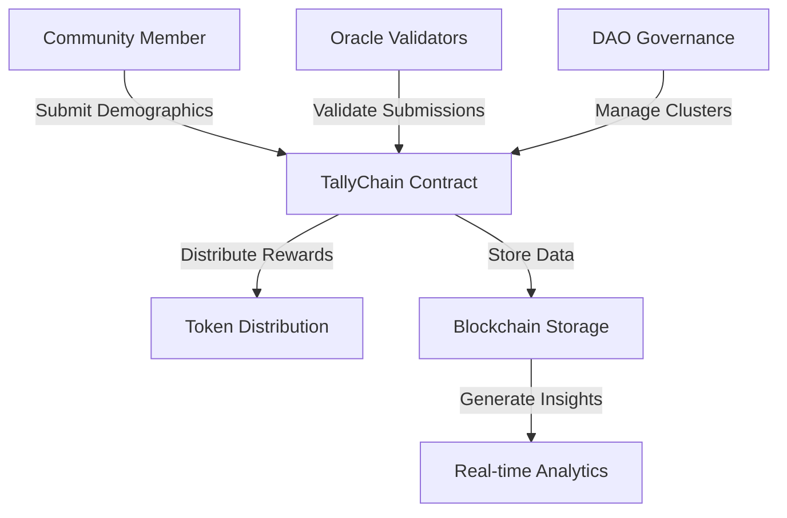

# 📊 TallyChain - Decentralized Community Census

🌐 **Real-time, transparent community demographics powered by blockchain technology**

## 🎯 Overview

TallyChain revolutionizes census data collection by creating a decentralized, community-driven platform where residents can anonymously report demographics while ensuring data integrity through oracle validation and DAO governance.

## ✨ Key Features

- 🔒 **Anonymous Demographics Submission** - Privacy-preserving data collection
- 👥 **Community Oracle Network** - Decentralized validation system
- 🏛️ **DAO-Managed Clusters** - Local governance for census regions
- 💰 **Token Incentives** - Rewards for participation and validation
- 📈 **Real-time Analytics** - Live demographic insights for communities
- 🛡️ **Tamper-proof Data** - Blockchain-secured census records

## 🚀 Quick Start

### Deploy Contract
```bash
clarinet deploy --testnet
```

### Basic Usage

#### 1. Create a Census Cluster
```clarity
(contract-call? .tallychain create-cluster "Downtown District")
```

#### 2. Register as Oracle Validator
```clarity
(contract-call? .tallychain register-oracle u1)
```

#### 3. Submit Demographics
```clarity
(contract-call? .tallychain submit-demographics 
  u1    ;; cluster-id
  u3    ;; age-range (1-6: 18-24, 25-34, 35-44, 45-54, 55-64, 65+)
  u1    ;; gender (0: male, 1: female, 2: other)
  u2    ;; income-range (1-5: <25k, 25-50k, 50-75k, 75-100k, 100k+)
  u3    ;; education (1-4: high school, bachelor, master, doctorate)
  u1    ;; employment (1-3: employed, unemployed, retired)
)
```

#### 4. Validate Submissions (Oracle Only)
```clarity
(contract-call? .tallychain validate-submission u1)
```

## 📋 Data Categories

### Age Ranges
- `1` → 18-24 years
- `2` → 25-34 years  
- `3` → 35-44 years
- `4` → 45-54 years
- `5` → 55-64 years
- `6` → 65+ years

### Income Ranges
- `1` → Under $25,000
- `2` → $25,000 - $50,000
- `3` → $50,000 - $75,000
- `4` → $75,000 - $100,000
- `5` → Over $100,000

### Education Levels
- `1` → High School
- `2` → Bachelor's Degree
- `3` → Master's Degree
- `4` → Doctorate

### Employment Status
- `1` → Employed
- `2` → Unemployed
- `3` → Retired

## 🔍 Query Functions

### Get Cluster Information
```clarity
(contract-call? .tallychain get-cluster-info u1)
```

### View Demographics Statistics
```clarity
(contract-call? .tallychain get-cluster-stats u1)
```

### Check User Submission
```clarity
(contract-call? .tallychain get-user-submission u1 'SP123...)
```

## 💎 Tokenomics

- **Submission Reward**: 100 STX tokens upon validation
- **Oracle Stake**: 1,000 STX required to become validator
- **Validation Reward**: 50 STX per successful validation
- **Validation Threshold**: 3 oracle confirmations required

## 🏗️ Architecture



## 🛠️ Development

### Prerequisites
- Clarinet CLI
- Node.js 16+
- Stacks Wallet

### Testing
```bash
clarinet test
```

### Local Development
```bash
clarinet console
```

## 🌍 Use Cases

- 🏙️ **Smart City Planning** - Data-driven urban development
- 🏛️ **Local Governance** - Transparent budget allocation
- 🏥 **Healthcare Planning** - Resource distribution optimization
- 🎓 **Education Policy** - School district planning
- 🚗 **Infrastructure** - Transportation and utilities planning

## 🔐 Security Features

- Anonymous submission hashes
- Multi-oracle validation requirements
- Stake-based oracle incentives
- Time-locked reward distribution
- Access control for administrative functions

## 📈 Impact Metrics

- Real-time demographic updates
- Community participation rates
- Oracle validation accuracy
- Geographic coverage analytics
- Data quality scores

## 🤝 Contributing

1. Fork the repository
2. Create feature branch
3. Submit pull request with tests
4. Follow security guidelines

## 📄 License

MIT License - see LICENSE file for details

---

**Built with ❤️ for transparent communities on the Stacks blockchain**
